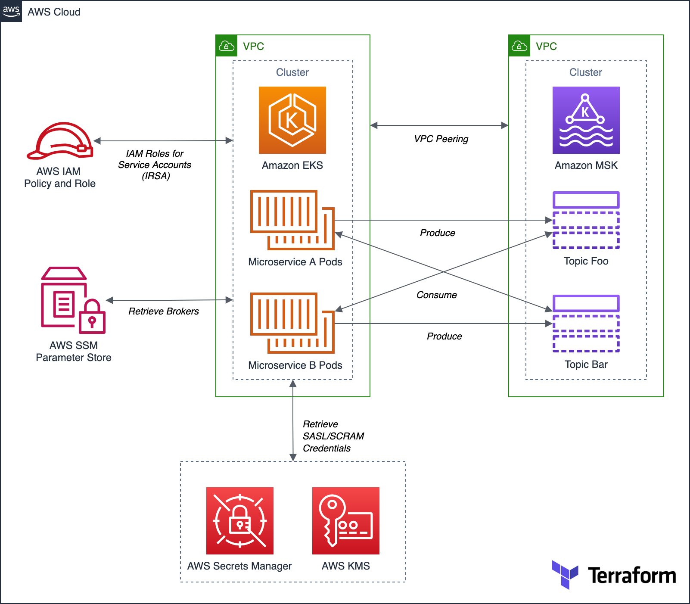

# Amazon MSK, Amazon EKS, SASL/SCRAM Demo

Terraform project for the post: [Securely Decoupling Applications on Amazon EKS using Kafka with SASL/SCRAM
Securely decoupling Go-based microservices on Amazon EKS using Amazon MSK with IRSA, SASL/SCRAM, and data encryption](https://itnext.io/securely-decoupling-applications-on-amazon-eks-using-kafka-with-sasl-scram-48c340e1ffe9)

This post explores a simple Go-based application deployed to Amazon Elastic Kubernetes Service (Amazon EKS). The microservices that comprise the application communicate asynchronously by producing and consuming events from Amazon Managed Streaming for Apache Kafka (Amazon MSK).

## Architecture

---

<i>The contents of this repository represent my viewpoints and not of my past or current employers, including Amazon Web Services (AWS). All third-party libraries, modules, plugins, and SDKs are the property of their respective owners.</i>
